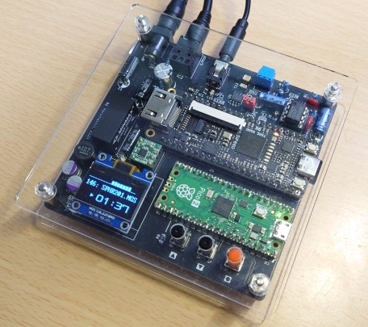

# MGSPICO3 
2024/10/12 harumakkin

 **fig.1 MGSPICO3**

## これは何？
OPLL、PSG、SCCの音源とRaspberryPiPico2を実装し、[MGSDRV](https://gigamix.jp/mgsdrv/)と[勤労五号(KINROU5.DRV)](https://sakuramail.net/fswold/music.html#muskin)を使用して、MGSとMuSICA楽曲データ再生し鑑賞できる個人製作のハードウェアです。VGMファイルも再生できます(圧縮形式の.vgzファイルには対応していません）
[MGSPICO](https://github.com/cliffgraph/MGSPICO)では、MSX用音源カートリッジを接続していました。[MGSPICO2](https://github.com/cliffgraph/MGSPICO2)では、実チップ(YM2413、YMZ294-D）とTangNano1K(SCC部)を実装してワンボード化しました。本作MGSPICO3ではTangNano9Kで、OPLL、PSG、SCCの三音源を実現し入手困難な実チップを使用使用しないようにしました。また、MGSPICO3ではS/PDIF光出力端子も実装しました。

## 使い方
### 用意するもの
- MGSPICO3
- [MGSDRV.COM(Ver3.20)](https://gigamix.jp/mgsdrv/)
- MGS楽曲データファイル（.MGSファイル）
- [KINROU5.DRV(Ver2.00)](https://sakuramail.net/fswold/music.html#muskin)
- MuSICA楽曲データファイル（.BGMファイル）
- microSD カード
- DC5V電源(センタープラス 2.1mm DCプラグ）

### microSD カードの準備、セットアップ
- [MGSPICO](https://github.com/cliffgraph/MGSPICO)と同様です。

## 操作方法
- [MGSPICO](https://github.com/cliffgraph/MGSPICO)と同様です。

## 設定画面の説明
- 起動時に●タクトスイッチを押しながら電源をONすると、設定画面に入ることができます。この画面ではターゲットの楽曲ファイル（MGS、MuSICA、VGM、TGF)や、SCC音源のモジュールの種類を切り替えることができます。この画面から抜けるには電源を入れ直すか、▲▼タクトスイッチを同時い押してください。
- SCC音源は、IKASCCとWTS(wave_table_sound)のどちらを使用するかを設定画面で選択できます。SCC+に対応しているのはWTSの方ですので、SCC+用の楽曲データ(VGMもしくはTGF）を再生すには、WTSを選択する必要があります。
- 設定内容はSDカード内に保存されます。

## ガーバーデータと部品表
- MGSPICO3-xxx/ ディレクトリ内を参照のこと。はんだ付けの難度は高いです。
- raspberry Pi Pico 2にインストールするファイルは、RasPiPico/dist/mgspico_3.uf2 です
- TangNano9Kに書き込むファイルは、RasPiPico/dist/mmp.fs です

# LICENSEと利用に関する注意事項
1. MGSPICO3のファームウェアとそのソースコード、回路図データおよび資料ファイルは MIT License で配布されます。ただし、MGSPICO3 は、FatFsと8x16文字フォントを使用しています。FatFs/8x16文字フォントのソースコードの扱いに関しては各々のLICENSEに従ってください。
2. 本作品は同人ハードウェア＆ソフトウェアです。本作品の設計およびソフトウェアは品質を保証していません。音源カートリッジや音響設備、その周辺機器が故障、破損したとしても自身で責任を負える方のみ本作品をご利用ください。特にハードウェアの製作を伴いますのでリスクがあります。製作の腕に自身のある方のみご利用ください。
3. 本作品の設計資料とソースコードの改変や改造、また、別の作品への利用、商用利用は自由です。ただし、1. 2.の制限を超える利用は各自でその責任と義務を負ってください。

### MGSPICO3が組込利用しているソフトウェア(PICO-SDK以外)
- FatFs Copyright (C) 20xx, ChaN, all right reserved. http://elm-chan.org/fsw/ff/00index_e.html
- 8x16 文字フォント FONT8X16MIN.h https://github.com/askn37/OLED_SSD1306
- wave_table_sound Copyright (c) 2021 HRA!. https://github.com/hra1129/wave_table_sound 
- IKAOPLL Copyright (c) 2023, Raki. https://github.com/ika-musume/IKAOPLL
- IKASCC Copyright (c) 2023, Raki. https://github.com/ika-musume/IKASCC
- ym2149_audio Copyright (c) 2020, Matthew Hagerty. https://github.com/dnotq/ym2149_audio

### 起動時に読み込んで使用しているソフトウェア
- MGSDRV (C) Ain./Gigamix https://gigamix.jp/mgsdrv/
- 勤労５号（MuSICA互換ドライバ）
(C) 1996,1997 Keiichi Kuroda / BTO(MuSICA Laboratory) All rights reserved. https://sakuramail.net/fswold/music.html#muskin

## 修正履歴
|date|MGSPICO3|firmware|note|
|:--|:--|:--|:--|
|2024/10/12|MGSPICO3-01D|mgspico_3.uf2(v2.13), mmp.fs(v2.13)|初版|

